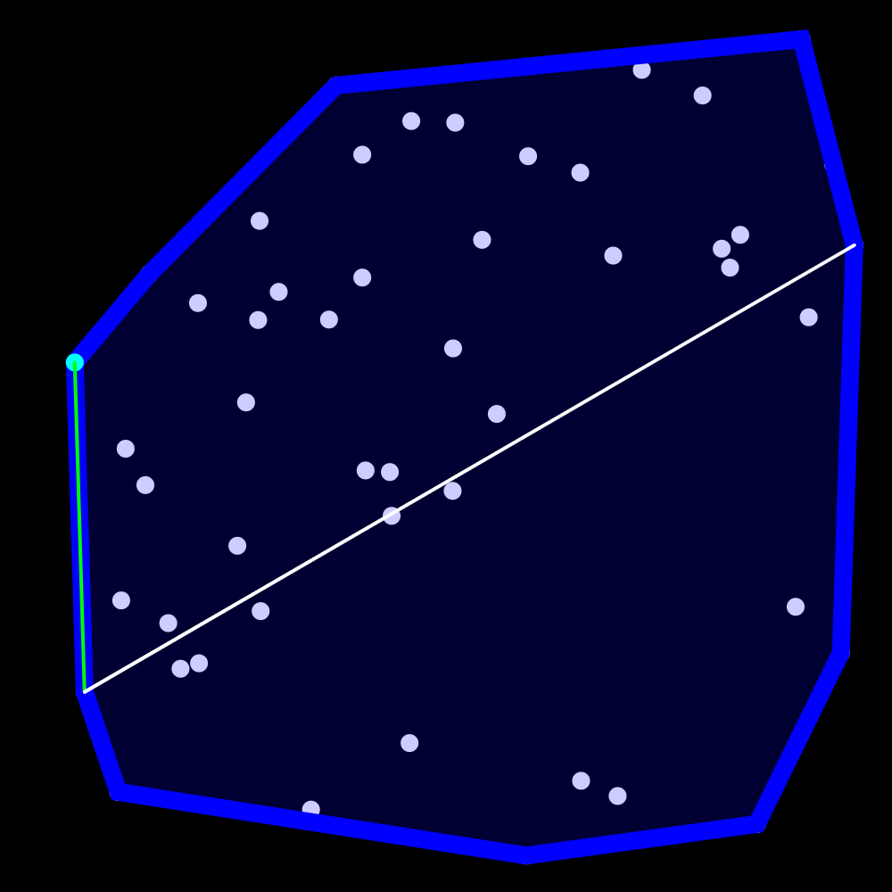
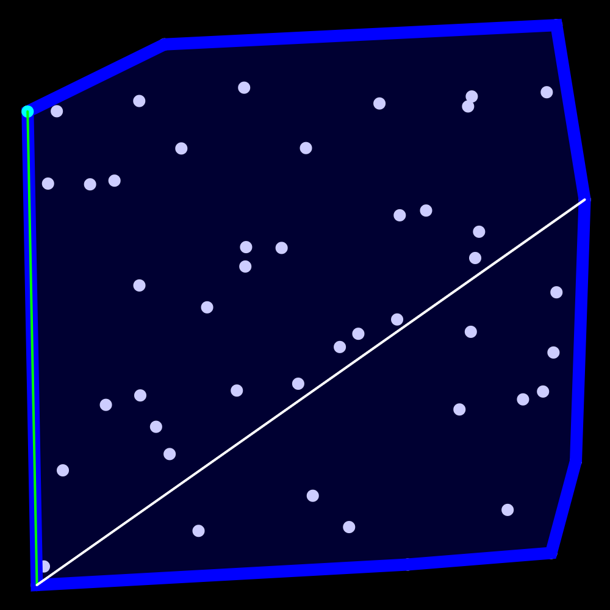
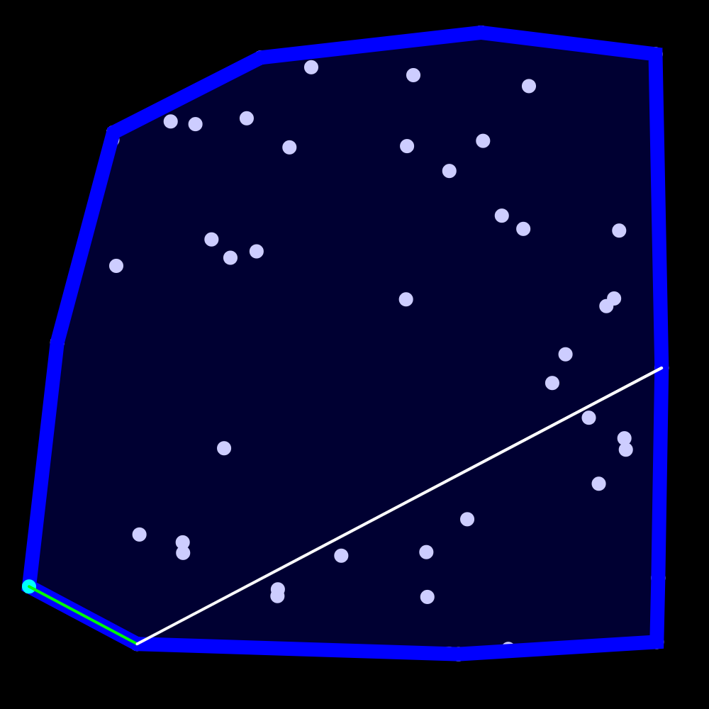
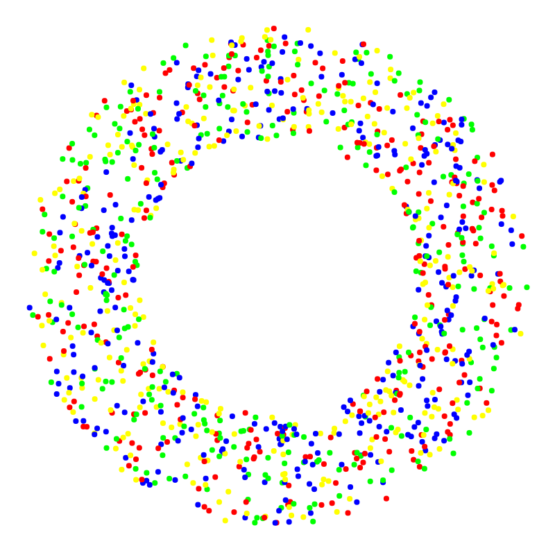
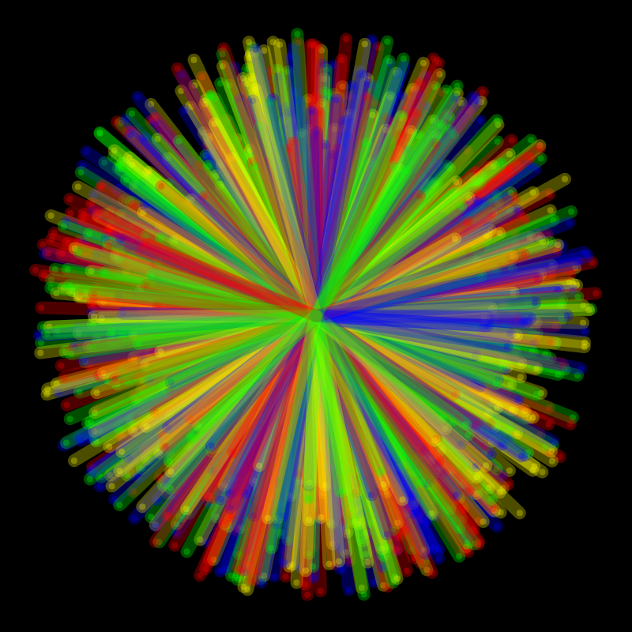
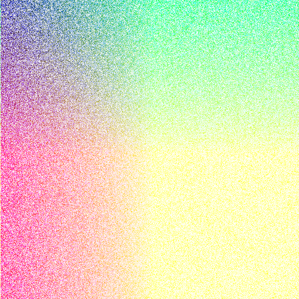
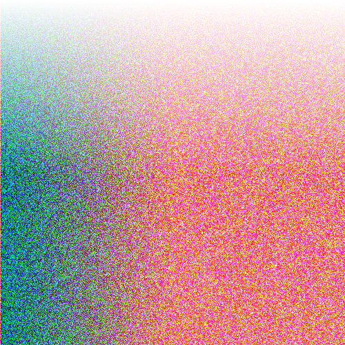
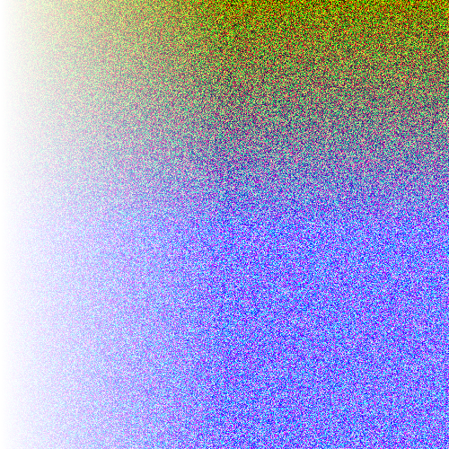

# Daily generative art

Practice done day by day to exercise p5.js, mathematical thinking and the possibilities of generative art.

# 2022

## January 2022

### 9th

> Gift Wrapping Algorithm

### 10th

> Random 2D Vector circular map

### 11th

> Color gradient noise

